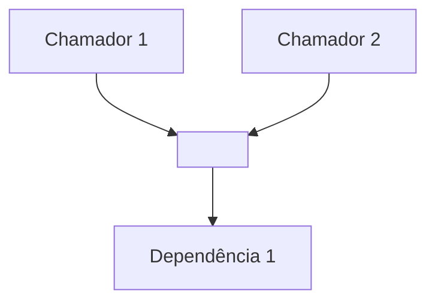

# Como funciona hoje: <NOME DA FUNCIONALIDADE>

> Escopo desta explicação: <descrição curta da mudança pretendida>
> Precisão das arestas de impacto: <tier2 preciso | tier1 aproximado | tier0 textual>

## Visão geral

<2–4 frases: papel da fatia, problema que resolve, peças-chave. Sem detalhe de
implementação. Este é o mapa mental.>

## As peças (detalhe condicional)

<Para cada elemento tocado, escolha a profundidade:>

- **<Peça trivial>** — <uma linha.>
- **<Peça significativa>** — <parágrafo curto: papel e conexões.>

### <Peça crítica> — `arquivo:linha`

<Trecho de código real, < 20 linhas:>

```<lang>
<código>
```

<Por que é crítico + efeito colateral + o "porquê" (commit/PR se houver).>

## Impacto da mudança

<Diagrama Mermaid do raio de impacto, se houver arestas:>



<Frase: o que uma alteração aqui vai tocar.>

## Rede de segurança

<Testes que já cobrem a fatia + lacunas de cobertura relevantes.>

## Pontos a confirmar

<As lacunas que a análise estática não resolve: dispatch dinâmico, DI,
cross-service, campos vazios do dossiê, tier baixo. Seja honesto.>

**Pergunta para você:** <uma pergunta objetiva para abrir a discussão antes da
proposta.>
