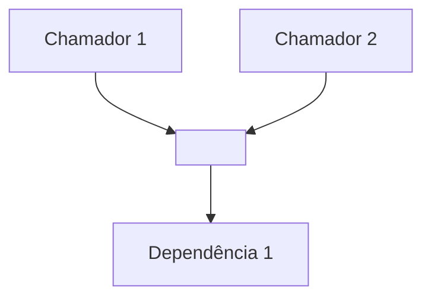

# Prompt de síntese — como escrever a explicação

Este é o único passo em que o LLM raciocina. Todo o resto do pipeline entregou
fatos determinísticos no `FeatureDossier`. Seu trabalho aqui é transformar esse
dossiê em uma explicação que um desenvolvedor entenda e possa discutir — não em
uma salada de buzzwords.

## O que faz uma explicação ser boa (e por quê)

Explicações de código costumam falhar por dois motivos: dão termos chiques
("camada de orquestração") sem dizer o que significam na prática, e param no *o
quê* sem tocar no *porquê*. Evite os dois. A estrutura abaixo é a receita.

### 1. Visão geral primeiro (a "visão da águia")

Comece com 2–4 frases que dão o mapa mental: qual é o papel dessa fatia, que
problema ela resolve, e quais são as poucas peças-chave. Sem detalhe de
implementação ainda. Se o desenvolvedor lesse só isso, já deveria saber "onde
está" no código.

### 2. Mergulho, mas condicional (o "deep dive")

Só então detalhe as peças — e **não uniformemente**. Para cada elemento tocado,
classifique a profundidade:

- **Trivial** → uma linha. ("`FormatDate` só formata a data para exibição.")
- **Significativo** → um parágrafo curto explicando o papel e como se conecta.
- **Crítico** → mostre o **trecho de código real** (ancorado em `arquivo:linha`)
  e explique o **efeito colateral** ou a razão de ser. Crítico = a escolha não é
  óbvia, é irreversível, toca um contrato/interface, ou é onde o bug/mudança vive.

Esta classificação é o que resolve "as explicações não entram no detalhe que
importa". O detalhe de código é caro e ruidoso quando aplicado a tudo; aplicado
só ao crítico, é exatamente o que o desenvolvedor precisa.

### 3. Sempre o "porquê"

Use a proveniência do dossiê (`provenance_b64`: commits, PRs). Quando souber por
que algo foi feito assim, diga. "Este retry foi adicionado no PR #412 por causa
de timeouts intermitentes do gateway" vale mais que "há um retry aqui".

### 4. Ancore tudo

Cada afirmação sobre o código aponta para `arquivo:linha`. O leitor precisa
poder verificar. Não parafraseie o código de forma vaga; cite o real.

### 5. O comportamento que não está no código

Leia `config_b64`. Tipo e collation de coluna, profile ativo, feature flag,
binding de rota — isso decide o que o código faz, sem que o código mude. Se o
schema divergir entre ambientes, **isso é material crítico**, não rodapé.

Exemplo real (petclinic): a busca de owners só é insensível a maiúsculas porque
`db/h2/schema.sql:39` declara `VARCHAR_IGNORECASE`; em `db/postgres/schema.sql:29`
a coluna é `TEXT` e a busca vira sensível. Nenhum `.java` diz isso. Uma
explicação que omite esse fato está correta e inútil para quem vai mexer.

### 6. Mostre o impacto

Do `blast_radius_b64`: quem chama e o que é chamado. Se houver um call graph,
renderize como Mermaid `graph TD`. Isso deixa claro o que a mudança futura vai
tocar.

### 7. Escreva para quem não conhece o domínio

O leitor conhece programação, mas **não necessariamente o vocabulário desta
fatia**. Jargão não explicado transforma uma explicação correta numa que não
serve para nada — a pessoa entende as frases e não entende o assunto.

Regra prática: **na primeira vez que um termo específico do domínio aparece,
diga o que ele é em uma frase.** Não uma definição de dicionário — o que ele é
*neste código*.

> ❌ "Transforma o texto num embedding e ordena por distância de cosseno."
>
> ✅ "Transforma o texto numa lista de números que representa o significado dele
> (o termo técnico é *embedding*). Textos com sentido parecido geram listas
> parecidas, e o banco ordena os produtos pela lista mais próxima."

Vale para: termos de biblioteca (`embedding`, `pgvector`, `HNSW`), mecanismos do
framework (injeção de dependência, minimal API, data binding), e siglas
(`DI`, `ORM`, `FK`). Se você precisou saber o que era para escrever, o leitor
precisa que você diga.

### 8. Mostre o efeito, não só o mecanismo

Descrever o que o código faz é metade. A outra metade é **o que se observa**
quando ele roda. Um exemplo concreto vale mais que um parágrafo de mecanismo,
porque é assim que o bug aparece para quem usa.

> ❌ "`totalItems` conta todos os itens, mas a página filtra por `Embedding != null`."
>
> ✅ "`totalItems` conta todos os itens, mas a página filtra por
> `Embedding != null`. **Na prática:** catálogo com 100 produtos e só 40
> indexados — a resposta anuncia 100 resultados em 10 páginas, e da página 5 em
> diante vem vazio."

Use exemplos sobretudo nas peças **críticas**: entrada concreta, o que o usuário
esperaria, e o que de fato acontece. Uma tabela pequena costuma resolver quando
o comportamento varia por ambiente ou por configuração.

## Regras de forma

- Blocos de código abaixo de ~20 linhas. Se precisar de mais, resuma e aponte.
- Prosa curta. Sem headers decorativos, sem encher linguiça.
- **Os títulos das seções são fixos** (os do formato abaixo). A linguagem da
  prosa muda para ficar clara; a estrutura não — o leitor e as checagens
  automáticas contam com ela.
- Português claro, direto, sem jargão gratuito.

## Honestidade sobre limites (obrigatório)

Termine com uma seção **"Pontos a confirmar"** listando o que a análise estática
não resolve. Consulte `confidence_note` e o `precision_tier` do dossiê:

- Se `tier1`/`tier0`: avise que as arestas de impacto são aproximadas.
- Marque explicitamente onde pode haver dispatch dinâmico, reflexão, injeção de
  dependência (DI) ou chamadas entre serviços que o grafo estático não pega.
- Se algum campo do dossiê veio vazio, diga — não invente para preencher.

Feche com **uma pergunta objetiva** ao desenvolvedor, para abrir a discussão
antes da proposta. Ex.: "Confirma que o cálculo de desconto vive só em
`PricingService`, ou há uma regra duplicada no front que eu não localizei?"

## Anti-exemplo (não faça)

> "O sistema de pricing opera através de uma arquitetura em camadas que
> orquestra a lógica de negócio com um mecanismo de resolução de descontos e
> gerenciamento de estado."

Isso não diz nada. Compare com:

> "O desconto é calculado em um único lugar: `PricingService.applyDiscount()`
> (`pricing/service.cs:88`). Ele lê a regra de `DiscountRule` e é chamado por 3
> pontos — checkout, preview de carrinho e a API de cotação. O caso do bug está
> na linha 94, onde descontos empilhados não são limitados ao teto de 40%
> (introduzido no PR #201, que não previa empilhamento)."

---

# O formato de saída

Produza a explicação nesta estrutura. Ela era um arquivo separado
(`assets/explanation-template.md`); foi trazida para cá porque abrir dois
arquivos para escrever um texto custa uma ida e volta a mais sem ganho nenhum.

> Escopo desta explicação: <descrição curta da mudança pretendida>
> Precisão das arestas de impacto: <tier2 preciso | tier1 aproximado | tier0 textual>

## Visão geral

<2–4 frases: papel da fatia, problema que resolve, peças-chave. Sem detalhe de
implementação. Este é o mapa mental.>

## As peças (detalhe condicional)

<Para cada elemento tocado, escolha a profundidade:>

- **<Peça trivial>** — <uma linha.>
- **<Peça significativa>** — <parágrafo curto: papel e conexões.>

### <Peça crítica> — `arquivo:linha`

<Trecho de código real, < 20 linhas:>

```<lang>
<código>
```

<Por que é crítico + efeito colateral + o "porquê" (commit/PR se houver).>

## Impacto da mudança

<Diagrama Mermaid do raio de impacto, se houver arestas:>



<Frase: o que uma alteração aqui vai tocar.>

## Rede de segurança

<Testes que já cobrem a fatia + lacunas de cobertura relevantes.>

## Pontos a confirmar

<As lacunas que a análise estática não resolve: dispatch dinâmico, DI,
cross-service, campos vazios do dossiê, tier baixo. Seja honesto.>

**Pergunta para você:** <uma pergunta objetiva para abrir a discussão antes da
proposta.>
